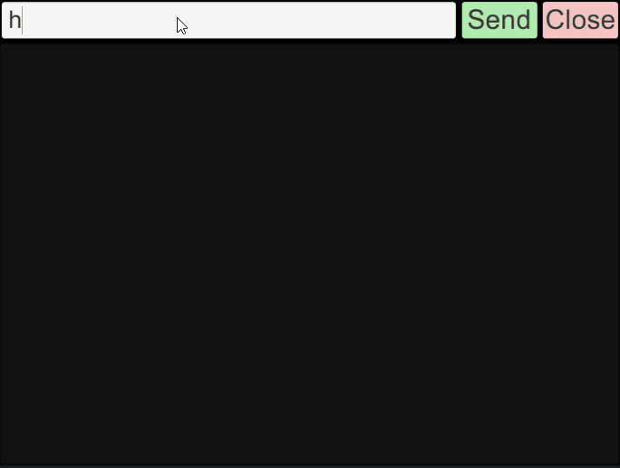

# UnityConsole
Nice efficient console for Unity.
Assumes that you have an orthographic camera with size at 320.

[Package](UnityConsole.unitypackage)



# Usage
```c#
public class Test : MonoBehaviour {
  public GameConsole gameConsole;

	// Use this for initialization
	void Start () {
        gameConsole.Initialize();

        for( var i = 0; i < 20; i++ ) {
            Debug.Log( i );
        }
        Debug.LogWarning( "Warning" );
        Debug.LogError( "Error" );

        GameConsole.AddCallback( "divide", ( Action<float, float> )Divide2Numbers, "Divide 2 floats, usage: divide 1.5 3" );
    }

    private void Divide2Numbers(float x, float y){
        Debug.Log("Division result: " + (x / y));
    }

    // Update is called once per frame
    void Update () {
        //Open when press "~"
        if (Input.GetKeyUp(KeyCode.BackQuote)) {
            GameConsole.OpenConsole();
        }
	}
}
```
